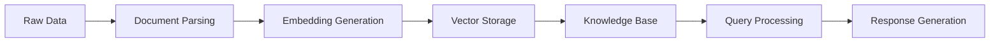

# Engine Metrics Agent - Requirements & Implementation Plan

## 📋 Information Needed From You

### 1. Firebase/GCP Account Setup
Please provide the following information:

#### Account Details
- [ ] Confirm pat@rapidtechconsultants.com has Firebase owner access
- [ ] Current Firebase project count and names (if any existing)
- [ ] GCP Organization ID (if RTS Technology & Solutions has a GCP org)
- [ ] Billing account setup status and current billing method
- [ ] Preferred GCP region (recommend us-central1 for cost/performance)

#### Access & Permissions
- [ ] Any additional team members who need access
- [ ] Preferred authentication method (Google OAuth, Firebase Auth, etc.)
- [ ] Security requirements or compliance needs
- [ ] Data residency requirements (US, EU, etc.)

### 2. Current Data Inventory

Please help me understand your current data landscape:

#### Data Sources & Locations
- [ ] **PGN Files**: Current location, total size, update frequency
- [ ] **JSON Analysis Results**: Format examples, data volume
- [ ] **Markdown Reports**: Types, frequency, content structure
- [ ] **ELO Progression Data**: CSV files, calculation methods
- [ ] **Puzzle Analysis**: Current format, storage location
- [ ] **Battle Results**: Historical data availability

#### Data Characteristics
- [ ] **Total Data Volume**: Estimated GB of historical data
- [ ] **Update Frequency**: How often new data is generated
- [ ] **Data Retention**: How long to keep historical data
- [ ] **Growth Rate**: Expected data growth per month
- [ ] **Critical Data**: Most important datasets for analysis

### 3. Use Case Priorities

Help me understand your most valuable use cases:

#### Primary Questions You Want to Ask
1. **Engine Development**:
   - [ ] "How has [engine] improved over the last [timeframe]?"
   - [ ] "What features correlate with performance gains?"
   - [ ] "Which development direction should I prioritize?"

2. **Performance Analysis**:
   - [ ] "What caused the performance regression in version X?"
   - [ ] "How does [engine] perform against different opponents?"
   - [ ] "Which time controls favor which engines?"

3. **Strategic Planning**:
   - [ ] "What's the optimal development roadmap?"
   - [ ] "Which engine shows the most promise?"
   - [ ] "How do my engines compare to industry standards?"

4. **Competitive Intelligence**:
   - [ ] "What patterns exist in Stockfish victories?"
   - [ ] "How do puzzle ratings correlate with game performance?"
   - [ ] "Which tactical improvements yield the best results?"

### 4. Technical Constraints & Preferences

#### Budget & Resources
- [ ] **Monthly Budget Range**: $50-100, $100-200, $200-500, $500+
- [ ] **Development Timeline**: Preferred completion date
- [ ] **Maintenance Preference**: Self-managed vs assisted
- [ ] **Scaling Requirements**: Expected user count, query volume

#### Integration Requirements
- [ ] **Existing Tools**: Current analysis workflows to maintain
- [ ] **Export Formats**: Preferred output formats (PDF, CSV, JSON)
- [ ] **API Access**: Need for programmatic access
- [ ] **Notifications**: Alert preferences for significant findings

#### Security & Privacy
- [ ] **Data Sensitivity**: Any confidential information in datasets
- [ ] **Access Control**: User roles and permissions needed
- [ ] **Audit Requirements**: Logging and tracking needs
- [ ] **Backup Strategy**: Data protection preferences

## 🏗️ Proposed Architecture Details

### Phase 1: Foundation (Weeks 1-2)

#### Firebase Project Setup
```yaml
Project Configuration:
  name: "chess-engine-metrics-ai"
  region: "us-central1"
  services:
    - Firebase Hosting
    - Cloud Storage
    - Firestore
    - Cloud Functions
    - Authentication
```

#### Data Storage Structure
```
Cloud Storage Buckets:
├── raw-data/
│   ├── pgn-files/
│   │   ├── v7p3r/
│   │   ├── slowmate/
│   │   └── c0br4/
│   ├── analysis-results/
│   │   ├── json/
│   │   └── reports/
│   └── puzzle-data/
├── processed-data/
│   ├── embeddings/
│   ├── summaries/
│   └── knowledge-base/
└── exports/
    ├── reports/
    └── visualizations/
```

#### Firestore Collections
```javascript
// Main collections structure
{
  engines: {
    engineId: {
      name: "V7P3R",
      versions: ["v10.8", "v10.9"],
      metadata: {...}
    }
  },
  battles: {
    battleId: {
      date: "2025-01-07",
      engines: ["V7P3R", "Stockfish"],
      result: {...},
      analysis: {...}
    }
  },
  performance: {
    performanceId: {
      engine: "V7P3R",
      date: "2025-01-07",
      elo: 2150,
      metrics: {...}
    }
  },
  queries: {
    queryId: {
      question: "How has V7P3R improved?",
      response: {...},
      timestamp: {...}
    }
  }
}
```

### Phase 2: AI Integration (Weeks 3-4)

#### Vertex AI Configuration
```python
# AI processing pipeline
class EngineMetricsAI:
    def __init__(self):
        self.embeddings_model = "text-embedding-004"
        self.llm_model = "gemini-pro"
        self.vector_db = ChromaDB()
        
    def process_documents(self, documents):
        # Generate embeddings for semantic search
        pass
        
    def query_knowledge_base(self, question):
        # RAG-based query processing
        pass
```

#### Data Processing Pipeline


### Phase 3: Intelligence Layer (Weeks 5-6)

#### Advanced Analytics
- **Pattern Recognition**: Identify trends across versions
- **Anomaly Detection**: Flag unusual performance changes
- **Predictive Modeling**: Forecast future performance
- **Correlation Analysis**: Find relationships between features

#### Recommendation Engine
- **Development Priorities**: Data-driven feature suggestions
- **Performance Optimization**: Specific improvement areas
- **Competitive Analysis**: Strategic positioning insights
- **Risk Assessment**: Impact analysis for new features

### Phase 4: User Experience (Weeks 7-8)

#### Web Application Features
- **Chat Interface**: Natural language querying
- **Visual Dashboard**: Interactive charts and graphs
- **Report Generator**: Automated analysis reports
- **Data Explorer**: Deep-dive into specific datasets

## 💡 Sample Conversations

### Engine Development Queries
```
User: "How has V7P3R's tactical performance improved since v10.8?"

Agent: "V7P3R has shown significant tactical improvements since v10.8:

📈 Tactical Pattern Detection:
- v10.8: Disabled (performance issues)
- v10.9: Re-enabled with time-adaptive system
- Result: 57% pattern detection rate, 99.91% budget compliance

🎯 Key Improvements:
- Time-control adaptive budgets (1-20ms)
- Emergency fallback system
- Format-specific tactical intensity

📊 Performance Impact:
- No NPS regression from v10.8 baseline
- Maintained 1856-2402 NPS across time controls
- 101,201 patterns detected in validation testing

Would you like me to analyze specific tactical scenarios or compare with other engines?"
```

### Strategic Planning Queries
```
User: "What should be my next development priority for V7P3R?"

Agent: "Based on your v10.9 success and historical data, I recommend:

🥇 Priority 1: Advanced Pattern Refinement
- Current tactical detection is foundational but basic
- Opportunity: Implement ML-based pattern weighting
- Impact: Estimated 15-25% tactical strength improvement

🥈 Priority 2: Opening Book Integration
- Gap: Limited opening knowledge vs. Stockfish
- Opportunity: Tactical-aware opening selection
- Impact: Better early-game positioning

🥉 Priority 3: Endgame Tablebase Integration
- Current: Basic endgame evaluation
- Opportunity: Perfect endgame play
- Impact: Conversion of winning positions

Risk Assessment: All priorities build on v10.9's stable foundation with low regression risk."
```

## 🚀 Next Steps

1. **Requirements Gathering**: Please fill out the checklists above
2. **Firebase Setup**: I'll guide you through project creation
3. **Data Migration**: Plan for moving your current analysis data
4. **Development Kickoff**: Begin Phase 1 implementation
5. **Regular Check-ins**: Weekly progress reviews and adjustments

## 📞 Contact & Support

**Project Lead**: AI Assistant  
**Client**: RTS Technology & Solutions LLC  
**Admin**: pat@rapidtechconsultants.com  

Ready to revolutionize your chess engine analysis with AI! 🏆